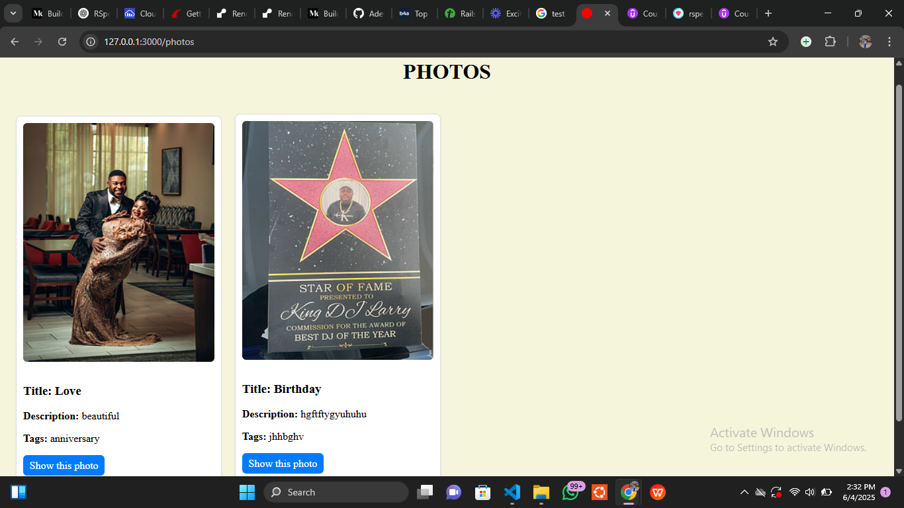
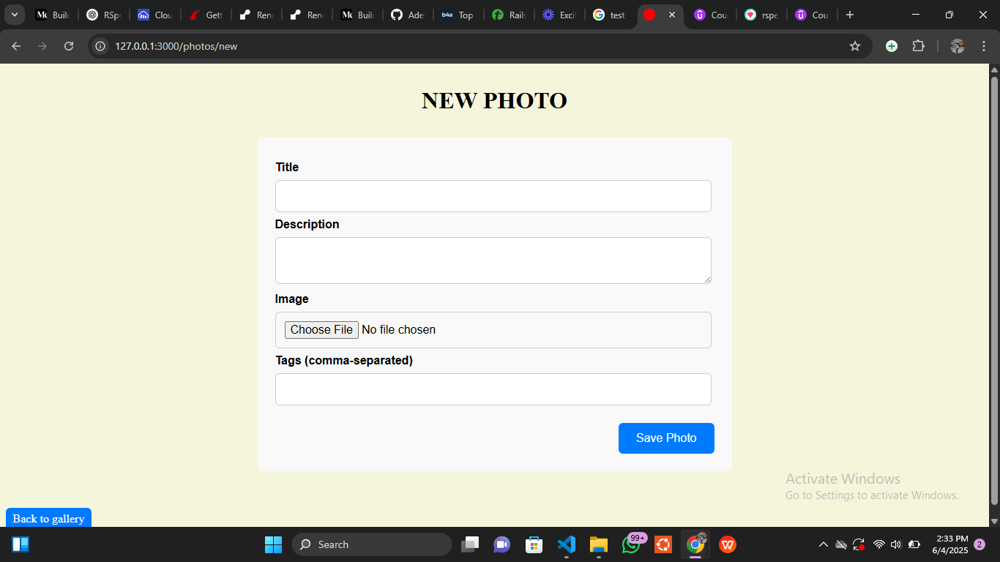
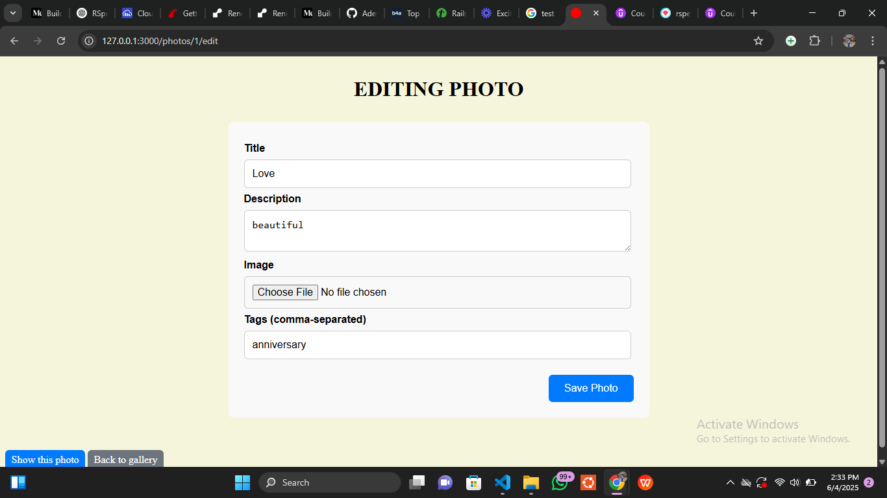
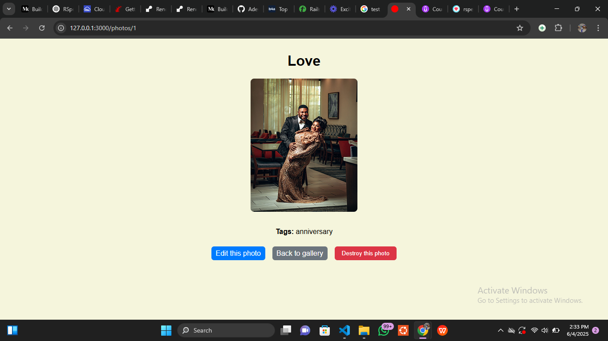

# 📸 Gallery
A simple photo gallery application built with Ruby on Rails and integrated with Cloudinary for image storage and management. This project allows users to upload, view, edit, and delete photos, with images stored securely on Cloudinary's free tier.

🚀 Features
- Upload photos with titles, descriptions, and tags.
- Store and retrieve images using Cloudinary.
- Responsive design for optimal viewing on all devices.
- Edit and delete existing photos.
- Display photo metadata, including tags and descriptions.

🛠️ Tech Stack
- Backend: Ruby on Rails
- Frontend: HTML, CSS.
- Image Storage: Cloudinary
- Database: PostgreSQL 
- Testing: RSpec, FactoryBot

## 📸 Screenshots

### 🏠 Gallery

### 📝 Add new Photo to gallery

### ✅ Edit a photo

### Display a photo

## 🔧 Installation
- Clone the repository: git clone https://github.com/Adewunmi97/Gallery.git
- run cd Gallery in your terminal
- Install dependencies:bundle install
- Set up the database:rails db:create, rails db:migrate

## Configure Cloudinary:
- Add the cloudinary gem to your Gemfile: gem 'cloudinary'
- Run bundle install to install the gem.
- Create a Cloudinary initializer at config/initializers/cloudinary.rb:
Cloudinary.config do |config|
  config.cloud_name = Rails.application.credentials.dig(:cloudinary, :cloud_name)
  config.api_key = Rails.application.credentials.dig(:cloudinary, :api_key)
  config.api_secret = Rails.application.credentials.dig(:cloudinary, :api_secret)
  config.secure = true
  config.cdn_subdomain = true
end
- Store your Cloudinary credentials securely using Rails credentials: EDITOR="code --wait" rails credentials:edit
- Add the following:
cloudinary:
  cloud_name: your_cloud_name
  api_key: your_api_key
  api_secret: your_api_secret
- Update config/storage.yml to include Cloudinary:
cloudinary:
  service: Cloudinary
- Set Active Storage to use Cloudinary in config/environments/development.rb and config/environments/production.rb:
config.active_storage.service = :cloudinary
- Start the Rails server:rails server
- Visit http://localhost:3000 to view the application.

## 🧪 Running Tests
To run the test suite: bundle exec rspec
Ensure that all tests pass to confirm the application is functioning correctly.

## 📚 Resources
- Build a Photo Gallery in Rails with Cloudinary (Free Tier) - Medium
- Cloudinary Documentation
- Ruby on Rails Guides

## Video Presentation

[Loom Link](https://www.loom.com/share/9d4a565f2ebb4519a52cbb7725e88aff?sid=0b01cd28-acb7-40e7-8a31-8ebbc1062320)

## 🤝 Contributing
Contributions are welcome! To contribute:
- Fork the repository.
- Create a new branch: git checkout -b feature/your-feature-name
- Make your changes and commit them: git commit -m 'Add your feature'
- Push to the branch: git push origin feature/your-feature-name
- Open a pull request.

## 👤 Author
Adewunmi A.
📫 @Adewunmi97

## Acknowledgments

- Juwon Oluwadare
- Project idea by [Antelo on Medium](https://antelo.medium.com/build-a-photo-gallery-in-rails-with-cloudinary-free-tier-0e42385c691a)

## 📄 License
This project is licensed under the MIT License.
